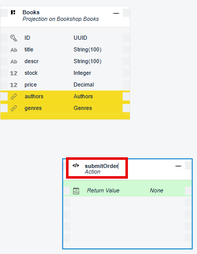
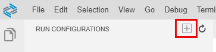

# Develop a Business App Using SAP Business Application Studio
<!-- description --> Develop a simple CAP Node.js application using SAP Business Application Studio.

## Prerequisites
- You have access to SAP Business Application Studio (see [Set Up SAP Business Application Studio for Development](appstudio-onboarding)).
- You have created a dev space as described in [Create a Dev Space for Business Applications](appstudio-devspace-create).


## You will learn
- How to create a CAP project
- How to develop business applications based on the SAP Cloud Programming Model (CAP)
- How to run and test your application using the Run Configurations tool

  The application you'll develop is a simple bookshop app consisting of a data model with three entities:

  - Books
  - Authors
  - Genres

  The data model is exposed via the Catalog Service. The application has some initial data that is used for testing the application, and some custom logic that runs after reading the books from the `Books` entity.

  Once you have all the code in place, you will test the application locally.

---

### Create new CAP project


1. From the SAP Business Application Studio hamburger menu, select **File > New Project from Template**.

2. Select the **CAP Project** template, and click **Start**.

    <!-- border -->

3. Enter **`bookshop`** as the name for the project.

4. Select the **SAP HANA Cloud** checkbox. 

    <!-- border -->

5. Click **Finish**.

    The project is generated and opens in the Storyboard.

    <!-- border -->


### Define bookshop data schema

1. In the **Data Models** tile, click **+** to create a data model entity.

    <!-- border -->

2. Click **Create**.

    <!-- border -->

    > It may take a few moments for the Graphical Modeler to be populated.

3. Change the entity name to **Books**.

    <!-- border -->

4. Click on the entity and then click on the  (Show Details) icon.

    <!-- border -->

5. In the **Properties** pane, click **+** to add new properties.

    <!-- border -->

7. Add the following properties:

    |Name| Type|
    | ---- | ---- |
    | title | String |
    | descr | String |
    | stock | Integer |
    | price | Decimal |

    The **Books** entity should look like this:

    <!-- border -->

8. Click **Add Entity**.

    <!-- border -->

9. Rename the new entity **Authors**.

10. Click on the entity and then click on the  (Show Details) icon.

    <!-- border -->

11. In the Properties pane, click **+** to add a new property.

    <!-- border -->

12. In the **Name** column, enter **title** and in the **Type** column select **String** from the dropdown list. 

13. Click **Add Entity**.

    <!-- border -->

14. Rename the new entity **Genres**.

15. Click on the **Authors** entity and then click on the Add Relationship icon.

      <!-- border -->

16. Drag the arrow to the **Books** entity.

    <!-- border -->

17. In the **Relationship Details** dialog, select the **To-One** radio button for the **Cardinality** and click **OK**. 
  
    <!-- border -->

18. Click on the **Genres** entity and then click on the Add Relationship icon.

    <!-- border -->

19. Drag the arrow to the **Books** entity.

    <!-- border -->

20. In the **Relationship Details** dialog, select the **Composition** radio button for the **Type**. 

21. Select the **To-Many** radio button for the **Cardinality** and click **OK**.
  
    <!-- border -->

### Define the bookshop service

1. In the storyboard, go to the **Service** tile, click **+** to create a service entity.

2. Click **Create**.

    <!-- border --> 

3. Click on the service and select **Add Service Entity**.

    <!-- border --> 

4. From the **Projection** dropdown list, select **Bookshop.Books**.

5. Click  to save your changes.

    <!-- border --> 

6. In the storyboard, click on the service and select **Add Action/Function**.

    <!-- border --> 
 
7. Change the name of the action to **submitOrder**. 

    <!-- border --> 

8. In the **Properties** pane, add the following:

    |Parameter Name| Parameter Type|
    | ---- | ---- |
    | amount | Integer |
    | books_id | Integer |

    <!-- border -->     


### Add initial data

1. In the storyboard, go to the **Data Models** tile, click on **Authors**, and select **Add Data**.

    <!-- border --> 

2. In the Data Editor, enter **3** for the number of rows with mock data and click **Add**.

    <!-- border --> 

3. Repeat the procedure to add rows for the **Genres** and the **Books** entities.


### Add custom logic


1. Go to the Explorer..
   
2. In the `srv` folder, create a new file called `service.js`.
   
3. If asked if you want to allow the use of the ESLint library for validation, click **Allow**.

    <!-- border -->

4. Populate the `service.js` file with the following:

    ```JavaScript
        /**
        * Implementation for CatalogService defined in ./cat-service.cds
        *    /
        const cds = require('@sap/cds')
        module.exports = function (){
          // Register your event handlers in here, e.g....
          this.after ('READ','Books', each => {
            if (each.stock > 111) {
              each.title += ` -- 11% discount!`
            }
          })
        }

    ```

5. Save your changes.
   
    Your application should look similar to the structure shown in the picture below.

    <!-- border -->

    You can also see the semantic structure of the application in the Project Overview.

    <!-- border -->


### Test the app with local database


You can explicitly deploy your application to a persistent local `SQLite` database, or you can run your application and it will implicitly use an in-memory database.

This step describes how to run the application with an in-memory database.

You will first add all required dependencies, and then create and run a run configuration.

1. Add and install all required dependencies.

    - From the **Terminal** menu, select **New Terminal**.

    - On the `bookshop` folder, run the following:

        ```NPM
        npm install

        ```

1. From the left side menu, open the Run Configurations view.

    <!-- border -->

2. Click **+** at the top of the view to add a new configuration.

    <!-- border -->

3. Select `Bookshop - (CAP Node project)` as the runnable application from the command palette prompt.

    <!-- border -->

    >There might be other run configuration options available in the command palette.

4. Press `Enter` to use the default name for the configuration. A new configuration is added to the run configuration tree.

5. Select SAP HANA CLoud as the database type.

    <!-- border -->

6. Log in to Cloud Foundry.

7. Select the relevant SAP HANA Cloud instance from the dropdown list.

8. Select the **Deploy data model to the SAP HANA instance before running** checkbox.

    <!-- border -->

9.  In the **Configuration** editor, go to the **Authentication** step and select the **Dummy** radio button. This will make the testing process easier since there is no need for username and password.

    <!-- border -->

10. Click the green arrow on the right of the configuration name to run the application.

    <!-- border -->

    The application opens in the browser. 
    
11. Click on **Books** to see the metadata and entities for the service.

    <!-- border -->

    You can also debug your application to check your code logic. For example, to debug the custom logic for this application, perform the following steps:

12. Place a breakpoint in the function in the `service.js` file.

13. In the running app, click the `Books` entity. It should stop at the breakpoint.

    <!-- border -->

14.  Click Continue in the debugger until all the books are read and the page is presented.

    <!-- border -->

15. Remove the breakpoint.

16. Stop the application by clicking Stop in the Debugger. The number beside the Debug icon represents the number of running processes. Click Stop until there are no processes running.

   


---
