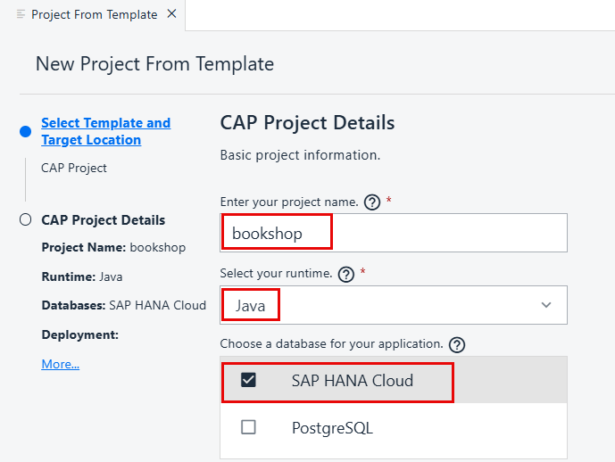

# Develop a CAP JAVA App Using SAP Business Application Studio
<!-- description --> Develop a simple CAP Java application using SAP Business Application Studio.

## Prerequisites
- You have access to SAP Business Application Studio (see [Set Up SAP Business Application Studio for Development](appstudio-onboarding)).
- You have created a **Full-Stack Application Using Productivity Tools** dev space as described in [Create a Dev Space for Business Applications](appstudio-devspace-create).


## You will learn
- How to create a CAP project
- How to develop business applications based on the SAP Cloud Programming Model (CAP)
- How to run and test your application using the Run Configurations tool

  The application you'll develop is a simple bookshop app consisting of a data model with three entities:

  - Books
  - Authors
  - Genres

  The data model is exposed via the Catalog Service. The application has some initial data that is used for testing the application, and some custom logic that runs after reading the books from the `Books` entity.

  Once you have all the code in place, you will test the application locally.

---

### Create new CAP Java project


1. From the SAP Business Application Studio hamburger menu, select **File > New Project from Template**.

    >You can also go to the Command Palette and choose **SAP Business Application Studio: New Project From Template**.

2. Select the **CAP Project** template, and click **Start**.

    <!-- border -->

3. Enter **`bookshop`** as the name for the project.

4. From the **Select your runtime** dropdown list, select **Java**.

5. Select the **SAP HANA Cloud** checkbox. 

    <!-- border -->

6. Click **Finish**.

    The project is generated.

7. From the SAP Business Application Studio hamburger menu, select **File > Open Folder**.

8. In the command palette, open the projects folder.
    
    <!-- border -->

9. Select your project and click **OK**.

    <!-- border -->

    The Storyboard is displayed.

    <!-- border -->


### Define bookshop data schema

1. In the **Data Models** tile, click **+** to create a data model entity.

    <!-- border -->

2. Click **Create**.

    <!-- border -->

    > It may take a few moments for the Graphical Modeler to be populated.

3. Change the entity name to **Books**.

    <!-- border -->

4. Click on the entity and then click on the  (Show Details) icon.

    <!-- border -->

5. In the **Properties** pane, click **+** to add new properties.

    <!-- border -->

7. Add the following properties:

    |Name| Type|
    | ---- | ---- |
    | title | String |
    | descr | String |
    | stock | Integer |
    | price | Decimal |

    The **Books** entity should look like this:

    <!-- border -->

8. Click **Add Entity**.

    <!-- border -->

9. Rename the new entity **Authors**.

10. Click on the entity and then click on the  (Show Details) icon.

    <!-- border -->

11. In the Properties pane, click **+** to add a new property.

    <!-- border -->

12. Add the following property:

    |Name| Type|
    | ---- | ---- |
    | name | String | 

13. Click **Add Entity**.

    <!-- border -->

14. Rename the new entity **Genres**.

15. Click on the **Authors** entity and then click on the Add Relationship icon.

      <!-- border -->

16. Drag the arrow to the **Books** entity.

    <!-- border -->

17. In the **Relationship Details** dialog, select the **To-One** radio button for the **Cardinality** and click **OK**. 
  
    <!-- border -->

18. Click on the **Genres** entity and then click on the Add Relationship icon.

    <!-- border -->

19. Drag the arrow to the **Books** entity.

    <!-- border -->

20. In the **Relationship Details** dialog, select the **Composition** radio button for the **Type**. 

21. Select the **To-Many** radio button for the **Cardinality** and click **OK**.
  
    <!-- border -->

### Define the bookshop service

1. In the storyboard, go to the **Service** tile, click **+** to create a service entity.

2. Click **Create**.

    <!-- border --> 

3. Click on the service and select **Add Service Entity**.

    <!-- border --> 

4. From the **Projection** dropdown list, select **Bookshop.Books**.

5. Click  to save your changes.

    <!-- border --> 

6. In the storyboard, click on the service and select **Add Action/Function**.

    <!-- border --> 
 
7. Change the name of the action to **submitOrder**. 

    <!-- border --> 

8. In the **Properties** pane, add the following:

    |Parameter Name| Parameter Type|
    | ---- | ---- |
    | amount | Integer |
    | books_id | Integer |

    <!-- border -->     


### Add sample data

1. In the storyboard, go to the **Data Models** tile, click on **Authors**, and select **Add Data**.

    <!-- border --> 

2. In the Data Editor, enter **3** for the number of rows with mock data and click **Add**.

    <!-- border --> 

3. Repeat the procedure to add rows for the **Genres** and the **Books** entities.

4. In the command palette, search for the `application.yaml` file.

   <!-- border -->

5. Add the following line in the `cds` section for the default profile.
   
    ```Java
    data-source.csv.paths : "test/data/**"

    ```

6. Save your changes.
   
    The file should look like this:

    <!-- border -->

    This configuration tells the application where the sample data is located within the project structure.


### Create a Java class for the custom event handler

1. Go to the Explorer.
   
2. Navigate to `srv` > `src` > `main` > `java / customer / bookshop`, and create a new folder called `handlers`.

    <!-- border -->

3. Add a new file in the `handlers` folder called `BookshopServiceHandler.java`.

    <!-- border -->
   
4. Populate the `BookshopServiceHandler.java` file with the following: 

    ```Java
    package customer.bookshop.handlers;
    import org.springframework.stereotype.Component;

    import com.sap.cds.Result;
    import com.sap.cds.services.cds.CdsReadEventContext;
    import com.sap.cds.services.cds.CqnService;
    import com.sap.cds.services.handler.EventHandler;

    import com.sap.cds.services.handler.annotations.After;
    import com.sap.cds.services.handler.annotations.ServiceName;

    @Component
    @ServiceName("bookshopService")
    public class BookshopServiceHandler implements EventHandler {

    @After(event = CqnService.EVENT_READ, entity = "bookshopService.Books")
    public void onRead(CdsReadEventContext context){
    Result result = context.getResult();
    //result.forEach(r -> System.out.println(r.get("title")));
    result.forEach(r -> {
    if( ((Integer) r.get("stock"))> 111)
    r.put("title",((String)r.get("title")).concat(" -- Discount"));
    });
    }
    }

    ```

    To learn more about working with event handlers, see [Event Handlers](https://cap.cloud.sap/docs/java/event-handlers/).

5. Save your changes.
   
    Your application should look similar to the structure shown in the picture below.

    <!-- border -->

    You can also see the semantic structure of the application in the Project Overview.

    <!-- border -->


### Test the app with local database


You can explicitly deploy your application to a persistent local `SQLite` database, or you can run your application and it will implicitly use an in-memory database.

This step describes how to run the application with an in-memory database.

You will first add all required dependencies, and then create and run a run configuration.

1. Add and install all required dependencies.

    - From the **Terminal** menu, select **New Terminal**.

    - On the `bookshop` folder, run the following:

        ```NPM
        npm install

        ```

1. From the Activity pane, open the Run Configurations view.

    <!-- border -->

2. Click **+** at the top of the view to add a new configuration.

    <!-- border -->

3. Select `Bookshop - (CAP Java)` as the runnable application from the command palette prompt.

    <!-- border -->

    >There might be other run configuration options available in the command palette.

4. Press `Enter` to use the default name for the configuration. A new configuration is added to the run configuration tree.

5. In the **Configuration** editor, select the **Default Profile** radio button for the database type. 

    <!-- border -->

6. Click the green arrow on the right of the configuration name to run the application.
 
    <!-- border -->

7. If prompted, open the application in a new tab.
   
    <!-- border -->

    The application opens in the browser. 
    
8.  Click on **Books** to see the metadata and entities for the service.

    <!-- border -->

    You can also debug your application to check your code logic. For example, to debug the custom logic for this application, perform the following steps:

9.  Place a breakpoint in the function in the `service.js` file.

10. In the running app, click the `Books` entity. It should stop at the breakpoint.

    <!-- border -->

11.  Click Continue in the debugger until all the books are read and the page is presented.

    <!-- border -->

12. Remove the breakpoint.

13. Stop the application by clicking Stop in the Debugger. The number beside the Debug icon represents the number of running processes. Click Stop until there are no processes running.

   
### Deploying your app

#### Prerequisites
 - Make sure you have an SAP HANA database available in your space. See [Create an SAP HANA Database Instance Using SAP HANA Cloud Central](https://help.sap.com/docs/hana-cloud/sap-hana-cloud-administration-guide/create-sap-hana-database-instance-using-sap-hana-cloud-central)
  
 - You have an SAP HANA service (SAP HANA as a Service or SAP HANA Cloud) available in your space.
    To create a new instance in your trial account:
    1. Go to your space in the SAP BTP cockpit.
    2. Go to **Service Marketplace**.
    3. Select **SAP HANA Schemas & HDI Containers**.
    4. Click **Create**.<br>
        <!-- border -->
    5. From the **Plan** dropdown menu, select `hdi-shared` as the service plan and provide a name for the new instance.
    6. Click **Create**.

1. From the Activity pane, open the Run Configurations view.

    <!-- border -->

2. Click **+** at the top of the view to add a new configuration.

    <!-- border -->

3. Select `Bookshop - (CAP Java)` as the runnable application from the command palette prompt.

    <!-- border -->

    >There might be other run configuration options available in the command palette.

4. Press `Enter` to use the default name for the configuration. A new configuration is added to the run configuration tree.

5. In the **Configuration** editor, select the **SAP HANA Cloud** radio button for the database type. 

    <!-- border -->
 
6. Log in to Cloud Foundry.

7. From the **SAP Cloud Instance** dropdown list, select the relevant instance.

8. From the **Deploy the data model before running** dropdown list, select the **Deploy (with data)** radio button. 

    <!-- border -->


9. Click the green arrow on the right of the run configuration.

    <!-- border -->

7. If prompted, open the application in a new tab.
   
    <!-- border -->

    The application opens in the browser. 

10.	From the terminal on the bookshop folder, run `cds add mta`. This adds an `mta.yaml` file to the root of your application.

    Note: If you are working on a trial account, open the `mta.yaml` file, and in the `resources` section change the `service` parameter to `hana`. Save your changes.

11.	Right-click the `mta.yaml` file and choose **Build MTA Project**.

    <!-- border -->

      A new folder for `mta_archives` is created containing the new `mtar` file.

12. Right-click the `mtar` file and choose **Deploy MTA Archive**.

    <!-- border -->

Once the task is complete, your application should be available in your Cloud Foundry space.
To access your application, go to your space in the SAP Cloud Platform cockpit and select **Applications** from the side menu.

---
