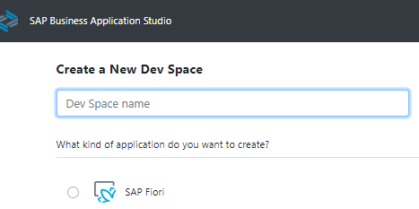
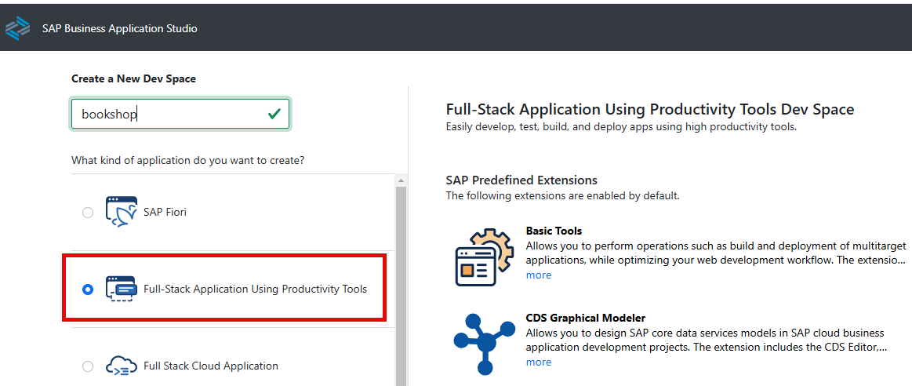

# Create a Dev Space for Business Applications
<!-- description --> Create a dev space for business applications -- a preconfigured development environment with the required tools and extensions for a specific scenario.

## Prerequisites
 - You are subscribed to SAP Business Application Studio. See [Getting Started](https://help.sap.com/viewer/9d1db9835307451daa8c930fbd9ab264/Cloud/en-US/19611ddbe82f4bf2b493283e0ed602e5.html)

## You will learn
  - How to create a dev space in SAP Business Application Studio for developing business applications

---
### Create your preconfigured dev space

1. Open **SAP Business Application Studio**.

2. Choose **Create Dev Space**.

    <!-- border -->

3. Choose a name for your dev space.

    <!-- border -->

4. Choose **Full Stack Cloud Application Using Prodictivity Tools** as the application type.

    <!-- border -->

    >Your dev space comes with several extensions out-of-the-box that you need to develop CAP applications. For example, CDS tools, Java Tools, and MTA Tools.

5. Choose **Create Dev Space**.

    <!-- border -->

    >The creation of the dev space takes a while. You see that the status for your dev space will change from **STARTING** to **RUNNING**.

6. Once the dev space is running, click the dev space name to open it.

### Test yourself

