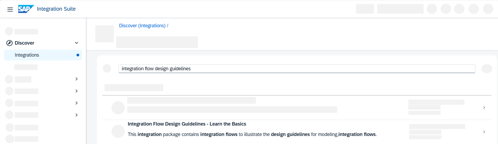
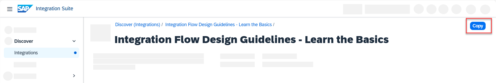
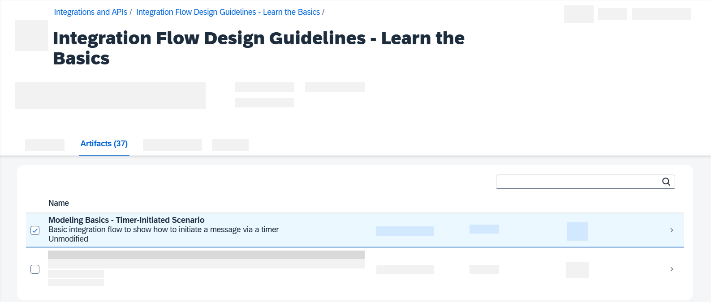
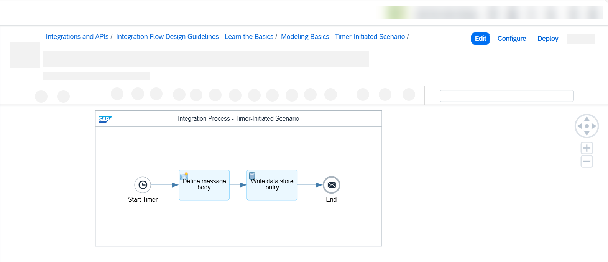
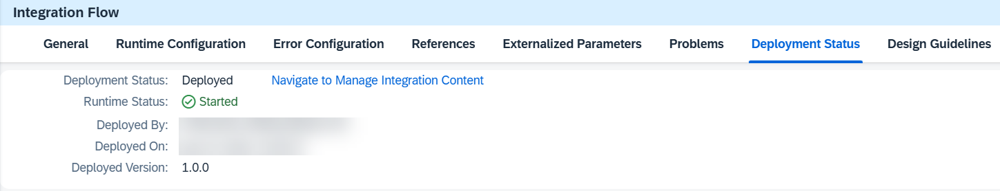

# Getting Started with Integration Flow Design Guidelines - Timer-Initiated Scenario
<!-- description --> In SAP Cloud Integration, copy and deploy a very simple out-of-the-box integration flow design guideline with a timer-initiated integration flow that writes an entry to the data store.

## Prerequisites
 - You have a trial account on SAP Business Technology Platform: [Get a Free Trial Account on SAP BTP](hcp-create-trial-account)
 - You have enabled Cloud Integration, capability of SAP Integration Suite, as described in [Set Up Integration Suite Trial](cp-starter-isuite-onboard-subscribe).

## You will learn
- How to find existing out-of-the-box integration flow design guidelines for SAP Cloud Integration, capability of SAP Integration Suite, and how to copy them into your tenant.
- How to deploy and work with integration flow design guidelines with minimal effort.
  
## Use Case
As an integration developer, you need to make sure that you design integration flows in a robust manner to safeguard your company's mission-critical business processes. To do so, you can leverage ready-made integration content as templates. The integration flow design guidelines offer best practices and ready-made content for you to start with your integration scenario. The integration flows are designed to meet the following requirements:

## Introduction
- Each integration flow focuses on one dedicated guideline or pattern, giving you easy access to the topic at hand.
- Each integration flow can be deployed and executed with minimum effort. That way, you can test each guideline or pattern on your own.
- You can use each reference integration flow as a basis for creating more complex scenarios.

Currently, the following topics are covered by the integration flow design guidelines - check them out for more inspiration on what you can do with SAP Integration Suite:

- [Learn the Basics](https://help.sap.com/docs/integration-suite/sap-integration-suite/learn-basics)
- [Run an Integration Flow Under Well-Defined Boundary Conditions](https://help.sap.com/docs/integration-suite/sap-integration-suite/run-integration-flow-under-well-defined-boundary-conditions)
- [Relax Dependencies to External Components](https://help.sap.com/docs/integration-suite/sap-integration-suite/relax-dependencies-to-external-components)
- [Keep Readability in Mind](https://help.sap.com/docs/integration-suite/sap-integration-suite/keep-readability-in-mind)
- [Handle Errors Gracefully](https://help.sap.com/docs/integration-suite/sap-integration-suite/handle-errors-gracefully)
- [Apply the Highest Security Standards](https://help.sap.com/docs/integration-suite/sap-integration-suite/apply-highest-security-standards)
- [Use the Partner Directory Appropriately](https://help.sap.com/docs/integration-suite/sap-integration-suite/use-partner-directory-appropriately)
- [Use Scripting Appropriately](https://help.sap.com/docs/integration-suite/sap-integration-suite/use-scripting-appropriately)
- [Enterprise Integration Patterns](https://help.sap.com/docs/integration-suite/sap-integration-suite/guidelines-to-design-enterprise-grade-integration-flows)

In this tutorial, you are going to download the easiest integration scenario currently offered by SAP Cloud Integration: **Modeling Basics - Timer-Initiated Scenario**. This scenario will show you how you can leverage integration flow design guidelines in integration scenarios - quickly and efficiently.

---

### Check out integration flow design guidelines for SAP Cloud Integration

After you've set up your SAP Integration Suite tenant (refer to the prerequisites of this tutorial for assistance), launch Integration Suite by selecting the respective tile. Now, you find yourself in the **Discover** > **Integrations** tab of Integration Suite. Here, you find all integration packages that are pre-delivered by SAP and its partners.

> Tip: *If your navigation bar is collapsed and you can only see icons, select the sandwich icon the upper left corner next to the SAP logo to enlarge the navigation bar.*

1. In the search field, type in `integration flow design guidelines`. You will see a list of integration packages. For each design guideline, one or more reference integration flows are documented and packed together into so-called integration packages.

2. Scroll down till you find the integration package called **Learn the Basics**.

    <!-- border -->

### Copy an integration flow package

Once you've found the integration package called **Learn the Basics**, copy it into your tenant.

1. Select your integration flow package.

2. Choose **Copy**. Wait for the confirmation that the package was copied successfully. 

<!-- border --> 

### Configure and deploy your integration flow

After you've successfully copied your integration flow package, go to **Design** > **Integrations and APIs**. You can now see a list of all existing integration packages on this tenant. Select your newly copied package by clicking on the title **Learn the Basics**.

1. In the package, you find yourself in the **Overview** tab. Switch to the **Artifacts** tab. You can now see all integration flows that are part of that integration package. There's usually more than one integration flow (artifact) packed into an integration package. The integration flow names follow the naming pattern 'Category-Guideline-extension'.

2. Select the integration flow you're interested in. In our example, **Modeling Basics - Timer-Initiated Scenario**.

    <!-- border -->  

3. You are now looking at the integration flow editor view. Here, your integration flow is displayed, showcasing all its components and steps. Your integration flow consists of three components:

    - A timer event **Start Timer** that is set to `Run Once` and that initiates the integration flow once it has been deployed;
    - A message body **Define message body** that defines a hard-coded message body that reads `Hello World!`;
    - A write step called **Write data store entry** that takes the message body and writes it to the data store.

      <!-- border -->

    > Tip: *Select the respective shapes, to view the parameters of the respective integration flow step. You might need to pull up the window from the bottom of your screen.*

    For integration flows, in general, you always have the following options:

      - **Edit**: This option allows you to edit the components and steps of the integration flow. You can add or delete steps, and/or change the adapter setup. In general, the edit-option is unnecessary for integration flow design guidelines as these flows are constructed in such a way that they meet the required criteria already.

    > **Caution**: In general, if you edit an integration flow, you will not receive any automatic updates for this edited integration flow once new features or steps are available.

      - **Configure**: This option allows you to configure parameters more easily via a quickly accessible wizard without having to edit the entire integration flow.

    In this tutorial, you do not need to configure or edit anything as this integration flow design guideline is ready to be deployed.

4.  Choose **Deploy** and select **Confirm transaction handling configuration**. 
   
5.  Upon deployment confirmation, choose the **Deployment Status** tab on the property sheet. Here, you can see details about the deployment for the integration flow. The expected deployment status is **Deployed** and runtime status is **Started**.

    <!-- border -->

### Check Integration Flow Deployment

In this final step, check whether the data store entry "Hello world" has been written to the data store.

1. Wait for a message to tell you that the deployment was successful.

2. From the left hand navigation bar, choose **Monitor** > **Integrations and APIs**.

3.  First, check the message processing log of the message. The message processing log (MPL) stores data about the messages processed on a tenant. Select **Monitor Message Processing** > **All Artifacts** > **Messages**.

    You now see a list of all messages that have run on this tenant. Select the entry with artifact name **Modeling Basics – Timer-Initiated Scenario** and check whether the Status displays a green success message: "Message processing completed successfully."

4. Now, to download the message. Go back to the **Monitor** > **Integrations and APIs** overview and select **Manage Stores** > **Data Stores**.

5. From the list, select the name of the data store. In this example **ModelingBasics-SmokeTest**.

6. Select the entry and click **Download** to download a file containing the predefined message body.

    <!-- border -->

7. Open the file with the "Hello World" message.

---

**Congratulations! You've successfully copied and deployed a very simple timer-initiated integration flow which is part of the Learn the Basics integration flow guideline.**

---
