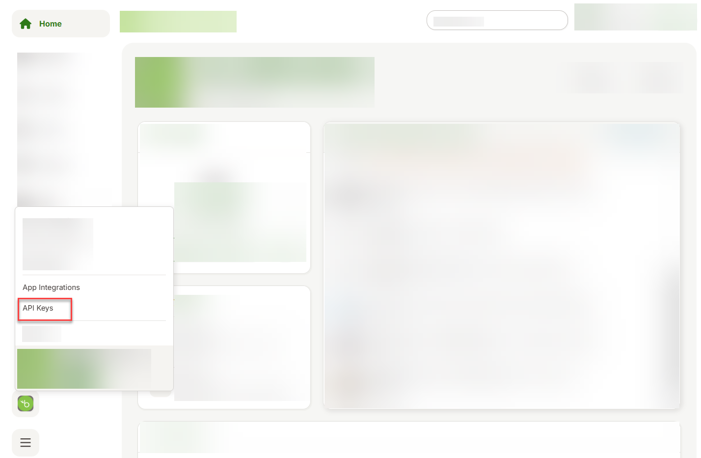
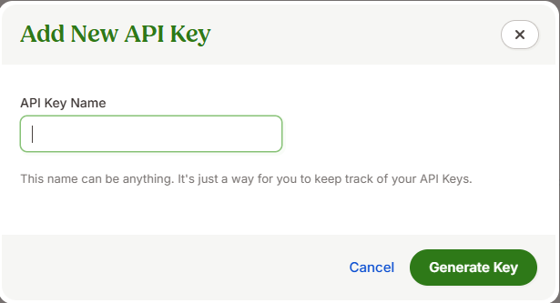

For the sake of providing an example, we're using a BambooHR trial system that already contains sample data. You can also use a third-party system of your choice to which connectivity is supported via Open Connectors. Currently, Open Connectors provides connectivity to more than 170 third-party applications and solutions. See [Connectors Catalog](https://help.openconnectors.ext.hana.ondemand.com/home/catalog).

> Remember that the BambooHR trial account is valid only for 7 days. If you start this tutorial today, make sure that you complete the mission within next 7 days.

# Preparing Your Non-SAP Application's Trial Account 
<!-- description --> Create a trial account with BambooHR and prepare it for integration with Open Connectors.

## You will learn
-	How to create a trial account with BambooHR
-	How to create an API Key 

### Sign up for a Free BambooHR Trial

1. In your web browser, open the [BambooHR Free Trial Sign Up](https://www.bamboohr.com/signup/) page.

2. Fill in your details and choose **Get Free Trial**.

    Based on the company name you provide, the domain name is auto-populated.

    <!-- border -->

3. If you want to change the domain name, choose **Edit** and provide a domain name of your choice.

    > Copy the domain name. You would need the domain name at a later point during the mission to establish connectivity. If your trial account is **mytrial.bamboohr.com**, then the domain name is **mytrial**.

4. Enter a password that meets BambooHR's password requirements.

5. Choose **Generate Your Account**.

    The activation takes a while to complete. After the activation is complete, launch your trial system to play around.

### Generate an API Key

SAP Integration Suite communicates with BambooHR via APIs. Each API request that is sent from SAP Integration Suite will be authenticated by BambooHR - for which you must generate an API Key. You can find more information [here](https://documentation.bamboohr.com/docs/getting-started#authentication).

1. On any page of the BambooHR system, in the bottom left corner, click on the BambooHR logo **Account** and choose **API Keys**.
    <!-- border -->

2. Add a new API Key by providing a name.

   <!-- border -->

3. Copy the actual key. You need the key to perform the subsequent steps of the mission.

---
