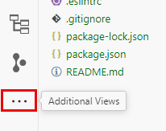
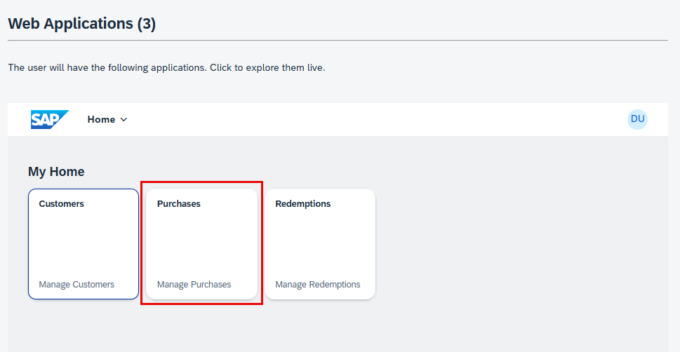
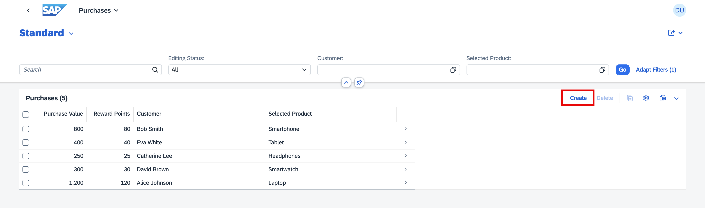

# Develop a Full-Stack CAP Application with Joule
<!-- description --> In this tutorial, you will use the Generative AI capabilities of Joule to create a CAP service in SAP Build Code. 

## Prerequisites
- You have an SAP BTP Trial account ([Get a Free Account on SAP BTP Trial](hcp-create-trial-account)).
- You have completed the [Setup SAP Build Code](https://developers.sap.com/tutorials/build-code-setup.html) tutorial. 
- You have created a **Full Stack Node** project as described in the [Create an SAP Build Code Application from the Lobby](https://developers.sap.com/tutorials/build-code-new-project.html) tutorial. 

## You will learn
- To leverage the power of Joule in SAP Build Code.
  
## Intro

Let's create an application for a customer loyalty program. The customer can get bonus points by purchasing products and can redeem these points. 

>**Note:** Joule is a Generative AI assistant that will create code for you. The code might be different every time you trigger the prompt, so the examples shown in the tutorial might not be exactly the same as what you see in your system.


### Create a multi-step CAP application

1. Open your **Full Stack Node** project.
   
2. In SAP Business Application Studio, the SAP Build Code development environment, open the digital assistant, Joule, from the activity bar.

    <!-- border -->

    >If you do not see the icon, click Additional Views and select **Joule** from the list.
    >
    >


3.  Copy the prompt below.

    ```code
    Create a customer loyalty application with sample data and application logic.
    ```

4. At the bottom of the Joule view, select the '/cap-gen-app` slash command and then paste the code below in the text field.

    <!-- border --> 

5. Click the arrow  to send the prompt to Joule.

    <!-- border --> 

    Since this is a complex task, Joule divides it into different steps and provides suggestions for the prompts for each step. You can edit these prompts before triggering the generation. 

    <!-- border --> 

    While Joule suggests certain properties for the entities, let's edit the prompt to offer a clearer description that aligns better with the data model's requirements. 

6.  Copy the prompt below.

    ```code
    Define 4 data entities: Customers, Products, Purchases and Redemptions. 
    Each customer must have the following fields: name, email, 7-digit customer number, total purchase value, total reward points, total redeemed reward points. 
    All fields for each customer should be `integer` except name and email that will be stored as `string`. 
    Each product should have a name, description, and price. 
    Purchases should include the following fields: purchase value, reward points. 
    All fields in Purchases must be `integer`. 
    Redemptions must have 1 field in `integer`: redeemed amount. 
    Each purchase and redemption will be associated to a customer. 
    Each purchase will be associated to a product and is called `selectedProduct`.
    Use associations instead of compositions.
    ```
    
7. Click  to edit step 1 and replace the prompt with the one you just copied. 

    <!-- border --> 

8. Click **Save**.

9. Click  to run the step and **generate the CAP data model**.

    <!-- border -->  

    The staging files are generated and are displayed below your prompt. You can view or edit them by clicking on the file name. 

    <!-- border --> 

    > Note: If you only want to create a data model and service, you can use the `/cap-gen-model` slash command. 

    Let’s edit the sample data to match requirements. 

10. Copy the prompt below.

    ```code
    Create sample data with meaningful information. Any phone numbers must be 10 digits long.
    All customer numbers must be 7 digits long and one customer must use the customer number 1200547. 
    No fields may be empty. 
    Total purchase value must be smaller than 10000 not rounded. 
    Both total reward points and total redeemed reward points must not be rounded, must not be identical. and must always sum to one-tenth of the total purchase value for each customer
    ```
    
11. Click  to edit step 2 and replace the prompt with the one you just copied.
    
    <!-- border --> 

12. Click **Save**.

13. Click  to run the step and **generate the CAP sample data**.
    
    The CSV files are created and can be opened for review from the Staging Files list.

    <!-- border --> 

    > Note: You can also trigger the sample data generation separately using the `/cap-gen-data` slash command or edit the existing data using the `/cap-edit-data` slash command.

    Now we will add application logic so that for each purchase, customers receive reward points equal to one-tenth of the purchase price. The purchase value will be added to the customer's account. 
    Additionally, when customers use reward points, the points should be deducted from their total reward points and added to their total redeemed points.

14. Copy the prompt below.

    ```code
    Implement application logic so that reward points of each purchase will be one tenth of the purchase value. 
    Each purchase value will be added to the total purchase value of the related customer. 
    Each reward point will be added to the total reward points of the related customer. 
    Furthermore, deduct the redemption amount from the customer's total reward points and add that to their total redeemed points.
    ```
    
15. Click  to edit step 3 and replace the prompt with the one you just copied. 

    <!-- border --> 

16. Click **Save**.

17. Click  to run the step and **generate the CAP application logic**.

    <!-- border -->  

    The relevant files are created with the required code. 

    > Note: In an existing project with application logic available, you can use the `/cap-app-logic` slash command to enhance or modify the logic.

18. Accept the code.

    <!-- border --> 

###  Add UI to the Application  

To display and test the content we created for the customer loyalty program, we need to create an SAP Fiori elements UI.

1. Go to back to the Storyboard and add a UI application.

    <!-- border -->

2. We will start with the user interface for the **Purchases** data entity. 

    Set the **Display name** to **Purchases** and the **Description** to **Manage Purchases**, and then click **Next**.

    <!-- border -->

3. We are using the browser, so we will select **Template-Based Responsive Application** as the UI Application type, and click **Next**.

    <!-- border -->

4. Select **List Report Page** as the UI application template, and click **Next**. 

    <!-- border -->

5. Select **Purchases** as the **Main entity**, and click **Finish**. The page will be created now.

    <!-- border -->

    It may take a few moments for the UI to be created because the dependencies need to be installed. 
    Once the UI is created, the Page Map opens providing options for further editing the UI.

6. Repeat steps 1 through 5 to create additional UI apps for the **Customers** and the **Redemptions** entities.

    **Customer**:

    * Display name: **Customers** <br/>
    * Description: **Manage Customers**
    * UI Application type: **Template-Based Responsive Application** <br/>
    * UI Application Template: **List Report Page** <br/>
    * Main Entity: **Customers** <br/>

    **Redemptions**:

    * Display name: **Redemptions** <br/>
    * Description: **Manage Redemptions** <br/>
    * UI Application type: **Template-Based Responsive Application** <br/>
    * UI Application Template: **List Report Page** <br/>
    * Main Entity: **Redemptions** <br/>

    And that's it! You've created an application.


### Preview the application (Optional)

1. Go to the Storyboard tab.

2. Click  to preview the application.

    <!-- border --> 

    The application's preview is displayed.

    <!-- border -->

3. Click the **Purchases** tile.

    <!-- border -->

4. Click **Go**.

    <!-- border -->

5. Create a new purchase.
   
    <!-- border --> 

6. Provide values for the **Purchase Value**, **Customer**, and **Selected Product** fields.

    <!-- border -->

    > Note: Joule may generate different code when presented with the same prompt. For example, you might see a customer represented as a number in the preview.

7. Click **Create**.
 
    <!-- border -->

8. From the dropdown list at the top of the page, select **Purchases**.

    <!-- border -->

    You can see the added line in the list of purchases, Because of the logic you added, the Reward Points are automatically added based on the purchase value.

    <!-- border -->

9.  From the dropdown list at the top of the page, select **Home** to go back and preview the other applications.

    <!-- border -->
