# Using Simplified Git in SAP Business Application Studio
<!-- description -->In this tutorial, we will walk through the basic Git operations such as cloning a repository, making changes, committing them, and pushing them back to the remote repository. 

SAP Business Application Studio enables you to connect and interact with the Git source control system. Using Simplified Git reduces the complexity of handling Git operations by simplifying certain multi-step operations into one action, including initialization and publishing of a Git repository or commit & sync.

## Prerequisites
- You have an SAP BTP Trial account ([Get a Free Account on SAP BTP Trial](hcp-create-trial-account)).
- You are subscribed to SAP Business Application Studio. See [Getting Started](https://help.sap.com/viewer/9d1db9835307451daa8c930fbd9ab264/Cloud/en-US/19611ddbe82f4bf2b493283e0ed602e5.html).
  
To begin using Simplified Git, you must have a project that includes a Git repository. From the **SIMPLIFIED GIT** view, you can open a folder with an existing Git project, clone a repository locally using a URL, or create a new project with a local Git repository and connect it to a remote one.

<!-- border -->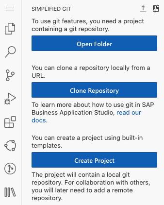

## You will learn
- To efficiently manage your source code using Simplified Git. 

### Clone a Repository from Git

Cloning a Git repository creates a local copy of a remote repository, allowing offline work with the full project history. It enables collaboration by letting you push local changes to update the remote repository and pull team updates to stay current, supporting teamwork and version control.

1. Click  to open **SIMPLIFIED GIT** from the activity bar.

2. Click **Clone Repository**.

    <!-- border -->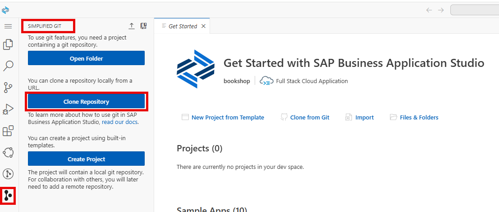

3. In the command palette, enter the URL of the repository containing the project you want to clone and press **Enter**.

    <!-- border -->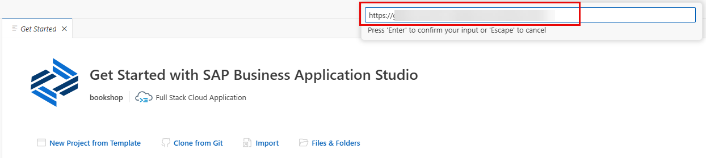

4. Select the `projects` folder and click **OK** to clone the repository to this folder.

    <!-- border -->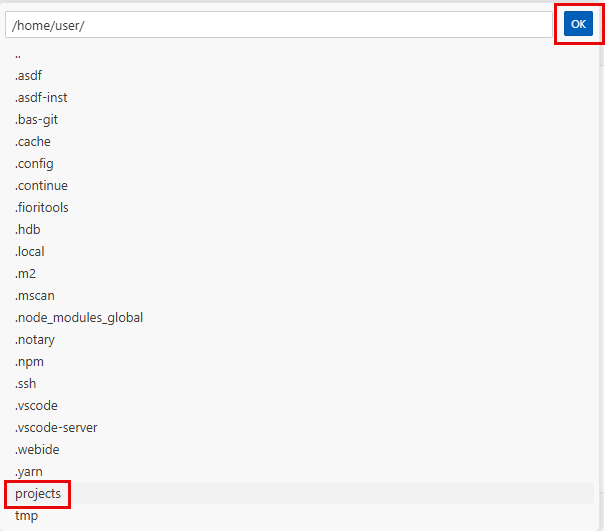

5. Enter your Git username and password (or token).
   
    <!-- border -->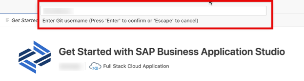

    <!-- border -->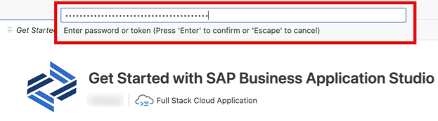
   
6. Choose whether to save your Git credentials for future use.

     <!-- border -->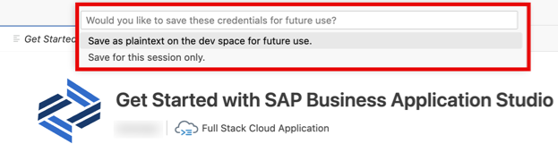

7. Click **Open** to open the cloned repository in SAP Business Application Studio.
   
    <!-- border -->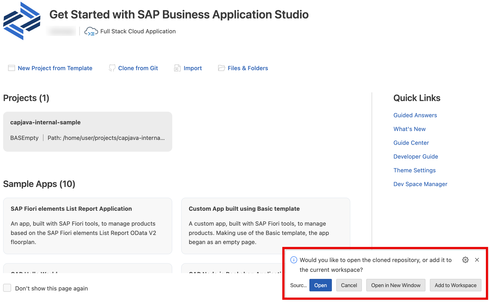

    >You can also choose to open the repository in a new window or to add it to the workspace.

    The project from the Git repository has been cloned into your dev space.

    <!-- border -->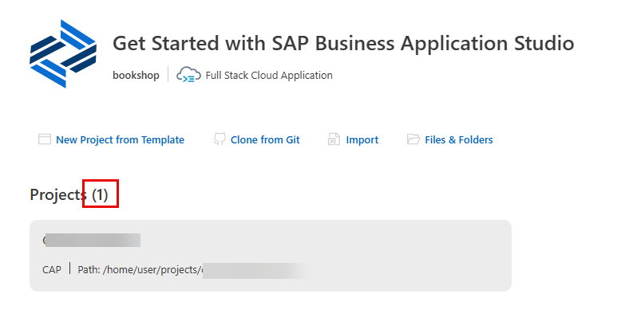. 

### Connect to a Remote Git Repository

Connect to a remote Git repository to enable contributions from other developers and to track changes in your project.

Before connecting to a remote repository, make sure the following prerequisites are met:

- The remote repository must be completely empty. This is necessary to prevent conflicts.
- Your user credentials must have at least WRITE permissions for the remote repository. Simplified Git requires write access to upload project content into the repository.

1. Click  to open **SIMPLIFIED GIT** from the activity bar.

2. If you have a project that is already initialized in Git, click **Add Remote Repository**.

3. If you haven’t created a project, perform the following steps: 
   
      1. Click **Create Project** to create one from a template. See [Creating a Project Using the Wizard](https://help.sap.com/docs/bas/sap-business-application-studio/creating-project-using-wizard).
   
      2. Click **Initialize & Publish Repository** if you haven't initialized your project in Git.
         This will initiate your project in Git and add a remote repository.

        <!-- border -->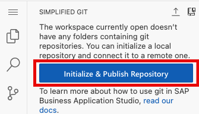

      3. In the command palette, select your project folder as the workspace folder to initialize the repository in.

        <!-- border -->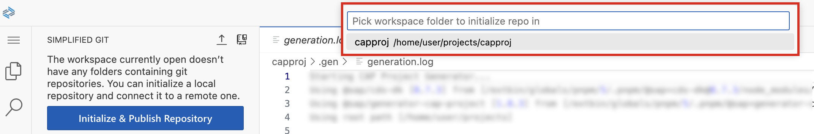

4. Add the URL for the remote repository where your local repository will be pushed.
   
    <!-- border -->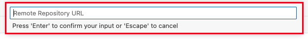

5. Enter your Git username and password (or token).

6. Choose whether to save your Git credentials for future use.
   
    The remote Git repository has been added.

### Commit Changes

"Committing changes" in source control is akin to saving a snapshot of your project at a specific point in time. When you make changes to a file or project, you review those changes and write a brief summary, known as a commit message, to explain what was done. By committing, you officially save these changes to the project's history, allowing you and your team to track modifications, understand the development process, and collaborate effectively. This also provides a safety net to revert to previous versions if mistakes occur.

1. Make a change to your project. For example, add a dummy file called `temp.txt`.

2. Click  to open **SIMPLIFIED GIT** from the activity bar. You will see your new file has been added to the **PENDING CHANGES** section. Likewise, the Simplified Git icon shows there is one change waiting for you.

    <!-- border -->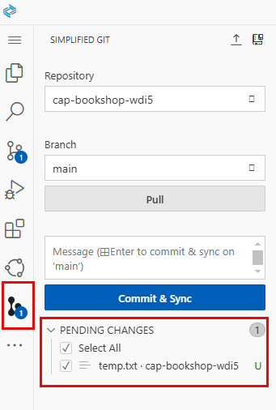

    >The **PENDING CHANGES** section lists all changes that you have made in your project that have not yet been committed and synced to your connected remote Git repository. Select the files with changes that you want to include in the commit by using the checkboxes beside each file.

3. Enter a message describing the change you made to the project.

    <!-- border -->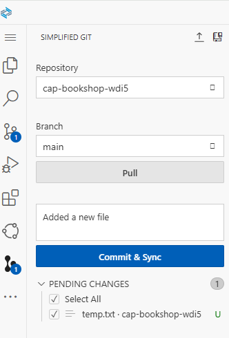

4. Click **Commit and Sync**.

    <!-- border -->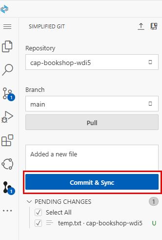

    Your changes are now added to the `main` branch of your project. This means that the changes will be visible to anyone else working on the project. You can create a separate branch where you can work and make changes until you are ready to commit to the `main` branch.

    >A repository contains branches, which are different lines of development or versions of the code. The main branch usually holds stable code. Locally, you have branches stored on your computer, while remote branches are on a server like GitHub or GitLab, allowing for collaboration with others.

### Pull Changes

Any time you work on a project, you should pull changes to ensure that you keep your local Git repository up to date with the remote repository. 

Pull is a combination of 2 commands: 

- `fetch`: Downloads the latest changes from the remote repository without modifying the local branch.
- `merge`: Merges the latest changes into your local branch.

1. Click  to open **SIMPLIFIED GIT** from the activity bar. You will see that updated files are displayed in the **PENDING CHANGES** section. Likewise, the Simplified Git icon shows changes waiting for you.
   
2. Click **Pull**.                                                                                               
   

    <!-- border -->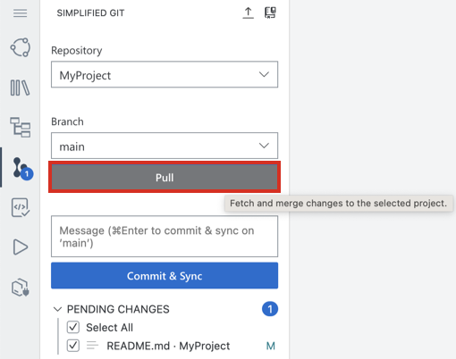 

    The changes made in the remote repository are now added to your local branch. 

### Resolve Conflicts

Merge operations can fail when the same parts of a file have been modified differently in the current (local) branch and the remote branch. In such cases, Git cannot automatically complete the merge, requiring manual intervention. Managing and resolving these conflicts is essential for maintaining an effective collaborative development workflow. To resolve these conflicts, you must review and edit the affected files to decide which changes to keep or modify.

When there are conflicts, the **MERGE FILES** section is displayed.
   
<!-- border -->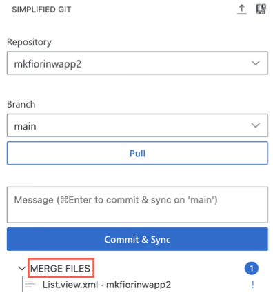

1. Click one of the files to resolve the conflict. A split view is displayed.

    <!-- border -->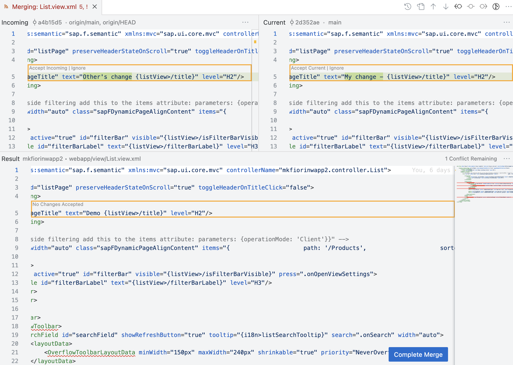

2. Choose one of the following options to resolve the merge conflict:
    - **Accept Current Change**: Apply the selected line of change from the current (local) branch.
    - **Accept Incoming Change**: Apply the selected line of change from the remote branch.
    - **Ignore**: Ignore the selected line of change.
    - **Complete Merge**: Opens the **SOURCE CONTROL** view for completing the merge. 
    
    >Only choose this option if you want to use the **SOURCE CONTROL** view.

3. Enter a message describing your changes and click **Commit & Sync** to complete the conflict resolution and sync your changes to the remote repository.
  
### Perform Actions in the Pending Changes Section

You can discard all selected changes, individually discard or ignore each pending change, or you can open an updated file in the **PENDING CHANGES** section.

#### Discard Changes

Discarding removes changes from the active branch.  

In the **PENDING CHANGES** section, you can discard the relevant changes:

- To discard all selected changes, hover over the **PENDING CHANGES** section title and click .

    <!-- border -->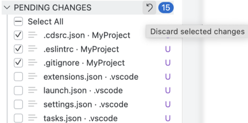

- To discard changes for a specific file, hover over the file containing the changes you want to discard and click .
  

    <!-- border -->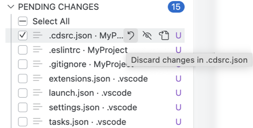

#### Ignore Pending Changes Individually

To ignore pending changes in a specific file, hover over the file containing the changes you want to ignore and click .

<!-- border -->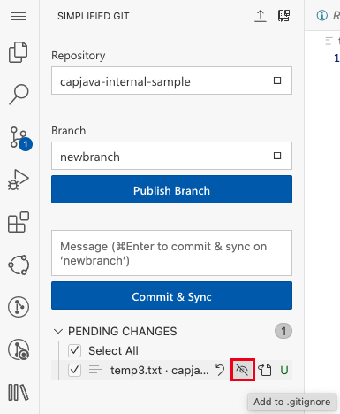

#### Open Updated File
To open a file with pending changes, hover over the file and click .

<!-- border -->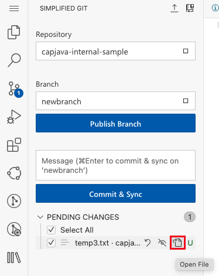

### Create a Branch

Create a new branch using the **SIMPLIFIED GIT** view and publish it to the remote repository.

1. In the **Branch** section, open the dropdown list and select **+ Add New Branch**.
   
    <!-- border -->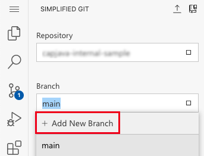

2. Enter a name for the new branch.

    <!-- border -->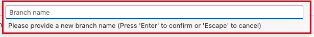

3. Select one the following options:
    - **main**: Create a branch of the main directory on the local repository.
    - **origin/main**: Create a branch of the main directory on the remote repository.
    
     <!-- border -->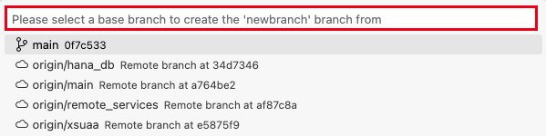

    The new branch is added to the dropdown list in the **Branch** section.

    <!-- border -->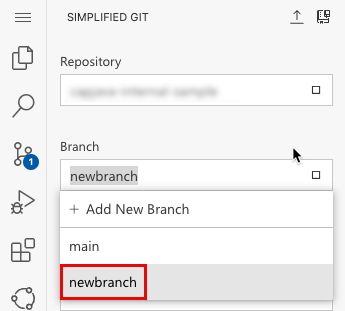

4. Select **Publish Branch** to sync the new branch with the remote repository.
   
    <!-- border -->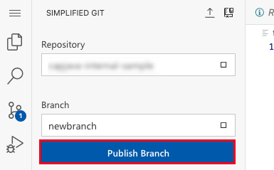