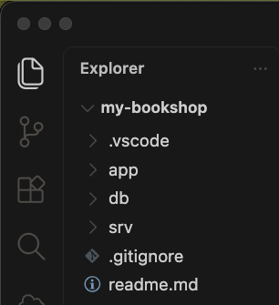
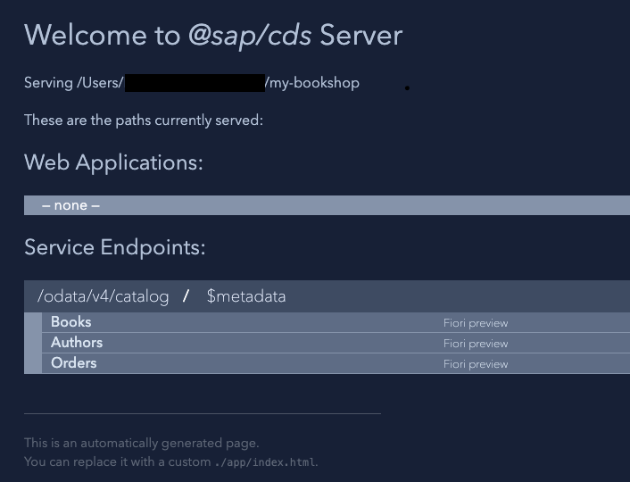
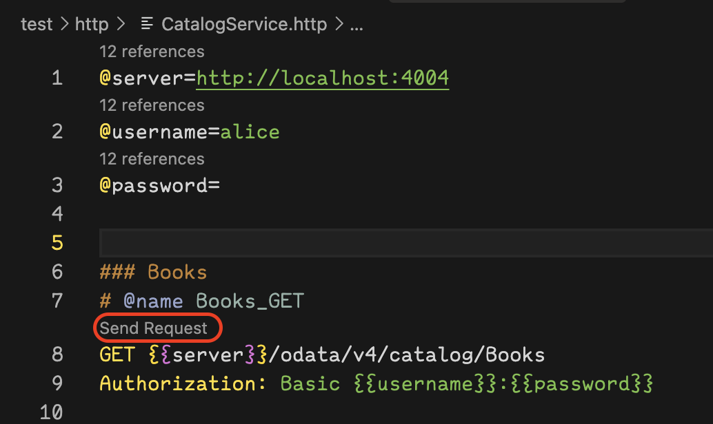
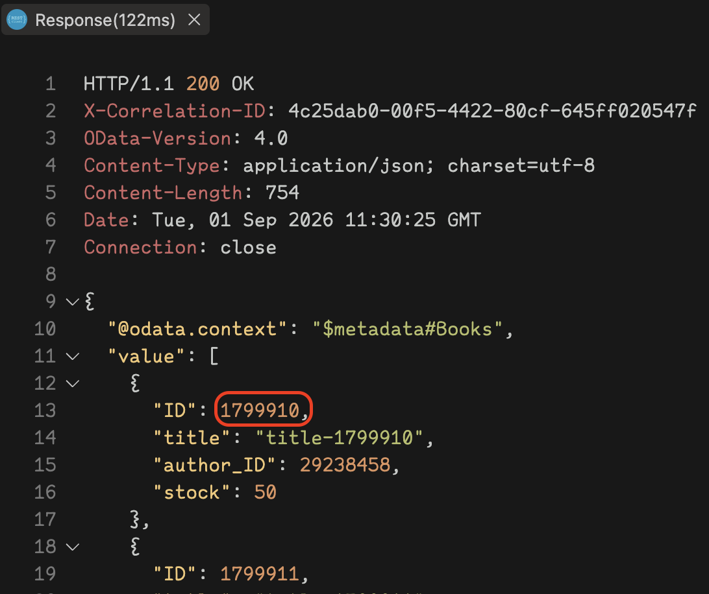

# Create a CAP Business Service with Node.js Using Visual Studio Code

<!-- description --> Develop a sample business service using Core Data & Services (CDS), Node.js, and SQLite, by using the SAP Cloud Application Programming Model (CAP) and developing on your local environment.

## You will learn

- How to develop a sample business service using CAP and `Node.js`
- How to define a simple data model and a service that exposes the entities you created in your data model
- How to run your service locally
- How to deploy the data model to an `SQLite` database
- How to add custom handlers to serve requests that aren't handled automatically

## Prerequisites

- You've installed [Node.js](https://nodejs.org/en/download/). Make sure you run the latest long-term support (LTS) version of Node.js with an even number like 20. Refrain from using odd versions, for which some modules with native parts will have no support and thus might even fail to install. In case of problems, see the [Troubleshooting guide](https://cap.cloud.sap/docs/advanced/troubleshooting#npm-installation) for CAP.
- You've installed the latest version of [Visual Studio Code](https://code.visualstudio.com/) (VS Code).
- (Windows only) You've installed the [SQLite](https://sqlite.org/download.html) tools for Windows. Find the steps how to install it in the [How Do I Install SQLite](https://cap.cloud.sap/docs/advanced/troubleshooting#how-do-i-install-sqlite-on-windows) section of the CAP documentation.
- Install the cds command line tool as described on [Capire](https://cap.cloud.sap/docs/get-started/#nodejs-and-cds-dk)
- Install the VS-Code extensions as described on [Capire](https://cap.cloud.sap/docs/get-started/#visual-studio-code-proposed-extensions)
- You've installed an HTTP client, for example, [REST client](https://marketplace.visualstudio.com/items?itemName=humao.rest-client).
- If you don't have a Cloud Foundry Trial subaccount and dev space on [SAP BTP](https://cockpit.hanatrial.ondemand.com/cockpit/) yet, create your [Cloud Foundry Trial Account](hcp-create-trial-account) with **US East (VA) as region** and, if necessary [Manage Entitlements](cp-trial-entitlements). You need this to continue after this tutorial.

---

## Intro

Before you start, complete the prerequisites and select your OS so that your see the correct instructions for your setup.

### Start project

[OPTION BEGIN [Windows]]

With your installed CDS command line tool, you can now create a new CAP-based project, in the form of a new directory with various things preconfigured, and run it.

> In case of problems during installation, see the [Troubleshooting guide](https://cap.cloud.sap/docs/advanced/troubleshooting#npm-installation) in the CAP documentation for more details.

1. Open a command line window and run the following command in a folder of your choice to create the project:

   ```Shell/Bash
   cds init my-bookshop --nodejs
   ```

    > This creates a folder `my-bookshop` in the current directory.

2. In VS Code, go to **File** **&rarr;** **Open Folder** and choose the **`my-bookshop`** folder.

3. Go to **Terminal** **&rarr;** **New Terminal** to open a command line window within VS Code and run the following command in the root level of your project:

   ```Shell/Bash
   cds watch
   ```

    > This command tries to start a `cds` server. Whenever you feed your project with new content, for example, by adding or modifying `.cds`, `.json`, or `.js` files, the server automatically restarts to serve the new content.

    > As there's no content in the project so far, it just keeps waiting for content with a message as shown:

   ```Shell/Bash
   cds serve all --with-mocks --in-memory? 
   ( live reload enabled for browsers ) 
   
           ___________________________
   
   
       No models found in db/,srv/,app/,app/*.
       Waiting for some to arrive...
   ```

[OPTION END]

[OPTION BEGIN [MacOS and Linux]]

1. Open a command line window and run the following command in a folder of your choice to create the project:

   ```Shell/Bash
   cds init my-bookshop --nodejs
   ```

    > This creates a folder `my-bookshop` in the current directory.

2. Open VS Code, go to **File** **&rarr;** **Open** and choose the **`my-bookshop`** folder.

3. Go to **View** **&rarr;** **Command Palette** **&rarr;** **Terminal: Create New Terminal** to open a command line window within VS Code and run the following command in the root level of your project:

   ```Shell/Bash
   cds watch
   ```

    > This command tries to start a `cds` server. Whenever you feed your project with new content, for example, by adding or modifying `.cds`, `.json`, or `.js` files, the server automatically restarts to serve the new content.

    > As there's no content in the project so far, it just keeps waiting for content with a message as shown:

   ```Shell/Bash
   cds serve all --with-mocks --in-memory? 
   ( live reload enabled for browsers ) 
   
           ___________________________
   
   
       No models found in db/,srv/,app/,app/*.
       Waiting for some to arrive...
   ```

[OPTION END]

### Define your first data model and service

After initializing the project, you should see the following empty folders:

- `app`: for UI artifacts
- `db`: for the database level schema model
- `srv`: for the service definition layer

  

Add normalized entity definitions into a data model and have your services expose potentially de-normalized views on those entities.

1. In the **`db`** folder choose the **New File** icon in VS Code and create a new file called `schema.cds`.

2. Add the following code to the file `schema.cds`:

   ```CDS
   namespace bookshop;

   entity Books {
   key ID     : Integer;
       title  : String;
       author : Association to Authors;
       stock  : Integer;
   }

   entity Authors {
   key ID    : Integer;
       name  : String;
       books : Association to many Books
                   on books.author = $self;
   }

   entity Orders {
   key ID     : Integer;
       book   : Association to Books;
       amount : Integer;
   }
   ```

    > Remember to save your files choosing <kbd>Ctrl</kbd> + <kbd>S</kbd>.

3. Let's feed it by adding a simple domain model. In the **`srv`** folder choose the **New File** icon in VS Code and create a new file called `cat-service.cds`.

4. Open the file `cat-service.cds` and replace the existing code with:

   ```CDS
   using {bookshop} from '../db/schema';

   service CatalogService {

      entity Books   as projection on bookshop.Books;
      entity Authors as projection on bookshop.Authors;
      entity Orders  as projection on bookshop.Orders;

   }
   ```

    > The syntax highlighting in your editor is provided by the extension. Learn more about it's features in this short [demo](https://www.youtube.com/watch?v=eY7BTzch8w0) and see the [features and commands](https://cap.cloud.sap/docs/tools/cds-editors#cds-editor) in the CAP documentation.

3. As soon as you've saved your file, the still running `cds watch` reacts immediately with some new output as shown below:

   ```Shell/Bash
   [cds] - loaded model from 2 file(s):
 
     srv/cat-service.cds
     db/schema.cds
   
   [cds] - using bindings from: { registry: '~/.cds-services.json' }
   [cds] - connect to db > sqlite { database: ':memory:' }
   /> successfully deployed to in-memory database. 
   
   [cds] - using auth strategy { kind: 'mocked' }
   [cds] - serving CatalogService {
     at: [ '/odata/v4/catalog' ],
     decl: 'srv/cat-service.cds:3'
   }
   [cds] - server listening on { url: 'http://localhost:4004' }
   [cds] - server v10.0.5 launched in 800 ms
   [cds] - [ terminate with ^C ]
   ```

    > This means, `cds watch` detected the changes in `srv/cat-service.cds` and automatically bootstrapped an in-memory SQLite database when restarting the server process.

4. To test your service, go to: <http://localhost:4004>

    

    > You won't see data, because you haven't added a data model yet. Click on the available links to see the service is running.

### Add initial data

1. You will add plain CSV files in folder `db/data` to fill your database tables with initial data. In **a new** command line window execute the following:

```sh
cds add data -n 10
```

This adds csv files with a header line and 10 rows of mock data for all entities to the `db/data/` folder. The name of the files matches the entities' namespace and name, separated by `-`.

   > After you added these files, `cds watch` restarts the server with an output, telling that the files have been detected and their content been loaded into the database automatically:

   ```Shell/Bash
   [cds] - loaded model from 2 file(s):
 
     srv/cat-service.cds
     db/schema.cds
   
   [cds] - using bindings from: { registry: '~/.cds-services.json' }
   [cds] - connect to db > sqlite { database: ':memory:' }
     > init from db/data/bookshop-Orders.csv 
     > init from db/data/bookshop-Books.csv 
     > init from db/data/bookshop-Authors.csv 
   /> successfully deployed to in-memory database. 
   
   [cds] - using auth strategy { kind: 'mocked' }
   [cds] - serving CatalogService {
     at: [ '/odata/v4/catalog' ],
     decl: 'srv/cat-service.cds:3'
   }
   [cds] - server listening on { url: 'http://localhost:4004' }
   [cds] - server v10.0.5 launched in 2708 ms
   [cds] - [ terminate with ^C ]
   ```

2. To test your service, open a web browser and go to:

    <http://localhost:4004/odata/v4/catalog/Books>

    <http://localhost:4004/odata/v4/catalog/Authors>

    > As you now have a fully capable SQL database with some initial data, you can send complex OData queries, served by the built-in generic providers.

    <http://localhost:4004/odata/v4/catalog/Authors?$expand=books($select=ID,title)>

    > You should see a book titled Jane Eyre. If not, make sure you've removed the mock data from `cat-service.js`.

### Test generic handlers

You can now see the generic handlers shipped with CAP in action.

Run the command to add http test files
```Shell/Bash
cds add http
```

The command creates a test file called `CatalogService.http` in the (newly created) `test/http` folder. The file has tests for each service definition and entity. This file can be used with the [REST client](https://marketplace.visualstudio.com/items?itemName=humao.rest-client) to make requests against your service. The generic handlers CAP provides sent the responses to your requests.

Click on `Send Request`, to execute requests against your service.



> This `Send Request` button is provided by the [REST client](https://marketplace.visualstudio.com/items?itemName=humao.rest-client). It appears for every single request. This is important for the following step, when you execute, for example, the `Order a Book` request.

The REST client gives you the response of your service and you see immediately if the request was successful. You can see the response with details about the books, like the ID and the title:

```JSON
{"ID": 1799910, "title": "title-1799910"}
```


> Note, when you stop and run `cds watch` again it only loads the generated CSV data to the in-memory database which is ideal for development. To preserve any changes you make, use a [persistent database](https://cap.cloud.sap/docs/guides/databases/sqlite#using-persistent-databases).

### Add custom logic

1. In the **`srv`** folder, create a new file called `cat-service.js`.

2. Add the following code to the file `cat-service.js`:

   [OPTION BEGIN [cat-service.js]]
   ```JavaScript
   const cds = require('@sap/cds')
   class CatalogService extends cds.ApplicationService {
       init() {
           const { Books, Orders } = this.entities
           this.after("CREATE", Orders, async (_, req) => {
               let { ID, amount, book_ID } = req.data
               let result = await UPDATE(Books, book_ID)
               .with ({ stock: {'-': amount}})
           })
           return super.init()
       }
   }
   module.exports = CatalogService
   ```
   [OPTION END]
   [OPTION BEGIN [cat-service.mjs]]
   ```JavaScript
   import cds from '@sap/cds';
   export default class CatalogService extends    cds.ApplicationService {
       init() {
           const { Books, Orders } = this.entities
           this.after("CREATE", Orders, async (_, req) => {
               let { amount, book_ID } = req.data
               let result = await UPDATE(Books, book_ID)
               .with ({ stock: {'-': amount}})
           })
           return super.init()
       }
   }
   ```
   [OPTION END]

> Remember to save your files choosing <kbd>Ctrl</kbd> + <kbd>S</kbd>.

> Whenever orders are created, this code is triggered. It updates the book stock by the given amount.

3. In the `CatalogService.http` file, execute the `Browse Books` request.

    > Look at the stock of book and note it's ID, for example, `1799910`.

    

4. Update the ID of the book with the ID from the last step and execute the `Orders_POST` request.

    > This triggers the logic above and reduces the stock.

5. Execute the `Browse Books` request again.

    > The stock of book `1799910` is lower than before.

> As an optional exercise, add a handler to make sure that there's enough stock for the order being created.

### Extend CDS Model

You can extend the CDS model using Expressions as well, to see this in action replace the projection on the Books entity in `srv/cat-service.cds` as shown here:

   ```CDS
   using {bookshop} from '../db/schema';

   service CatalogService {
   entity Books as
       select from bookshop.Books {
           *,
           stock > 50 ? title : title || ' - 10% discount' as displayTitle : String
       }
   
       entity Authors as projection on bookshop.Authors;
       entity Orders  as projection on bookshop.Orders;
   
   }
   ```
Now when you run the `Browse Books` Requests again you will see that the books with stock greater than 50 will have a 10% discount in the title.

[Learn more about the CDS Expression Language (CXL)](https://cap.cloud.sap/docs/cds/cxl)

> As an other optional exercise, update the handler to apply the discount if the order is eligible for it.
