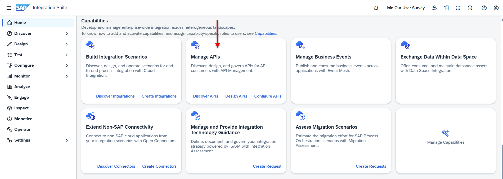
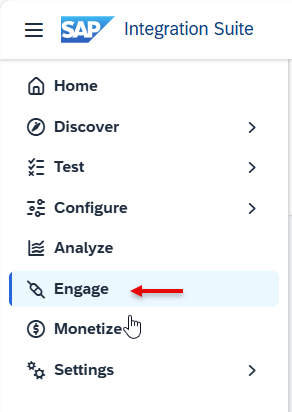
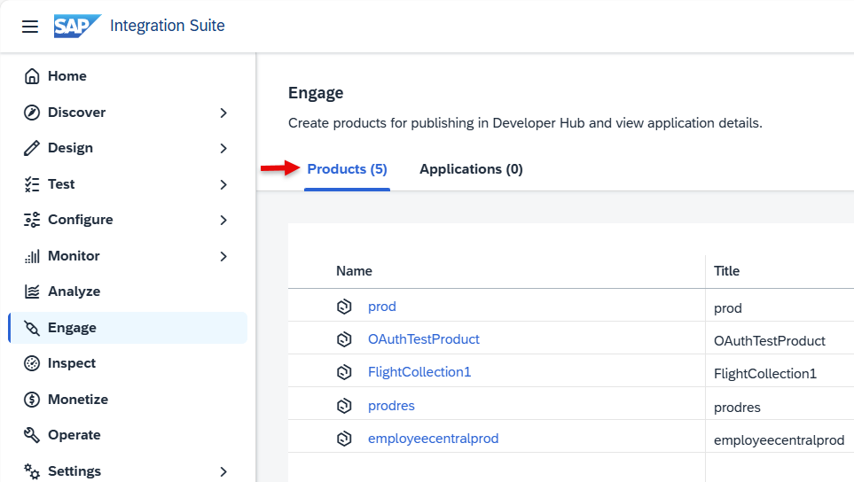
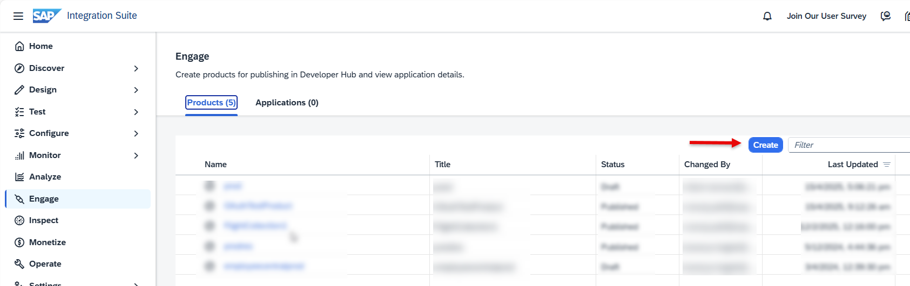
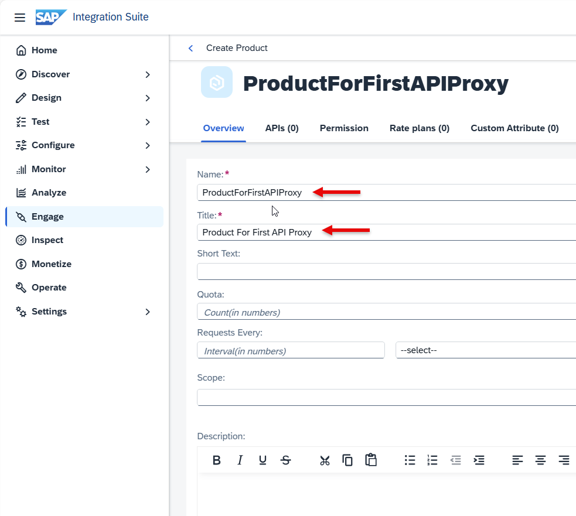
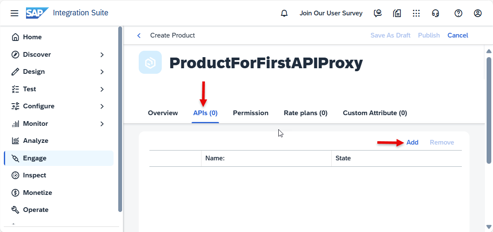
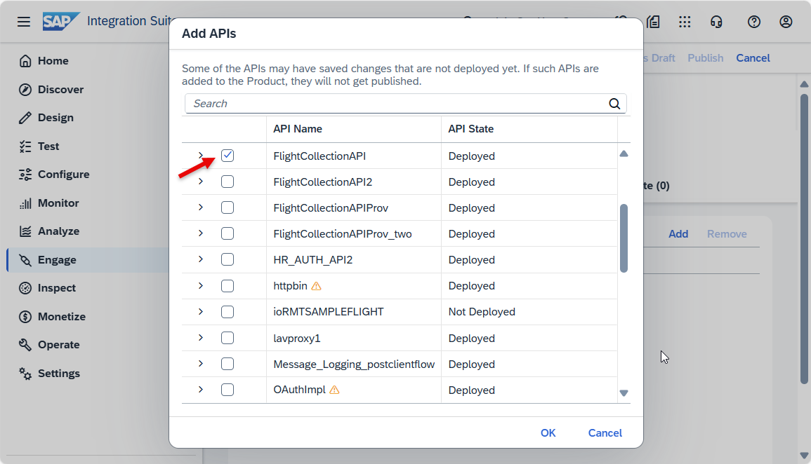
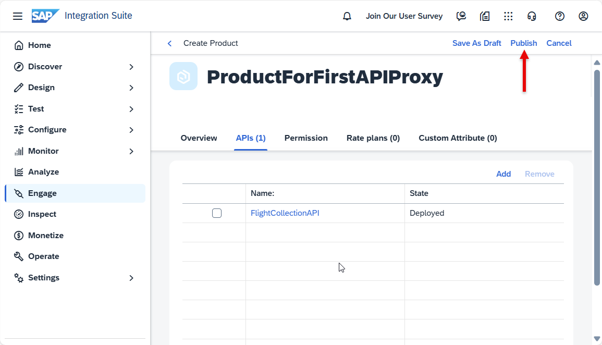
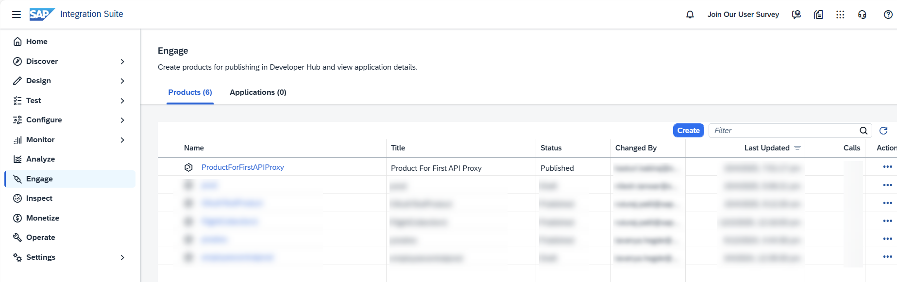

# Add an API Proxy to a Product
<!-- description --> In SAP Integration Suite, API proxies are grouped and exposed as products. In this tutorial you will create a new product and assign the previously created API proxy to it.

## Prerequisites  
- **Proficiency:** Beginner
- **Tutorials:** [Create an API Proxy](hcp-apim-create-api)

## Next Steps
- **Tutorials:** [Protect your API proxy by adding an Application Key Verification](hcp-apim-verify-api)

## You will learn  
In SAP Integration Suite, API Management uses three main components to expose APIs.
- The API Provider is used to abstract the connection to the backend / target system.
- The API Proxy is the actual API which contains the logic to connect to the target system. Here you can model the flow, add security policies, transform the incoming message or look for content injections.
- The API Product which bundles one or more API Proxies before they are exposed in the API Developer portal so they can be consumed by a developer.

## Intro
In SAP Integration Suite, API proxies are grouped and exposed as products. In this tutorial you will create a new product and assign the previously created API proxy to it
## Time to Complete
**15 Min**.

---

### Open the SAP API Management API Portal

Log on to **SAP Integration Suite** (you can get the URL from SAP Integration Suite Launchpad, click on **Manage APIs**).

### View current products

To access the list of products, select the **Hamburger Menu** in the upper left corner and click on **Engage**.

Select **Products** from the tab menu. This will bring up the list of previously created products.

### Create a new product

On the **Products** tab, click on **Create** to start the new product wizard.

### Add name and title

On the Overview page, enter the values for *Name* and *Title*.

**Field** | **Value**
---- | ----
Name |`ProductForFirstAPIProxy`
Title | Product For First API Proxy

### Select the API Proxy

In the tab menu, select **API**. This is where you can add and remove APIs and API proxies from the product.

Click the **Add** button.

The list of API proxies is populated from the APIs you have created. Select the API proxy `FlightCollectionAPI` that you created in the previous tutorial. Click **OK**.

### Click Publish

Click on **Publish**.

The product is now available.

